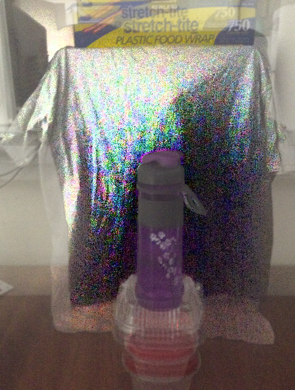

# transparency
Input: Two photos of the same semi-transparent object on different
solid-colored backgrounds

Output: A single image with the background removed and the correct opacity for
each pixel

The algorithm is as follows:

## Detect edges
1. Call `getEdgeFilter` to generate a 1D edge detection kernel. It's a
gaussian kernel that switches from positive to negative at the center.
1. For each image, combine the absolute values of the horizontal and vertical
convolutions with this kernel (using grayscale versions of the images).
1. Add a vignette effect using `getSpotlight` so that edges near the center
have more weight.

Here is the result of edge detection, with the color curve adjusted for
visibility:

## Align images (translation only)
1. Use the 2D convolution of the two edge-filtered images to find the best
alignment.
1. Save the 2D convolution as [`alignmentScores.png`](alignmentScores.png) to
allow human inspection.
1. Crop the images to the area where they intersect when aligned.

## Calculate axis of color difference
Our code still doesn't know the background color of each image. First we will
find the direction of the color-space vector connecting the two background
colors. This vector is called the "hub", and its direction is called the "hub
axis". In theory, the line connecting each pair of corresponding pixels should
be parallel to the hub axis.

Intuitively, we just want to compute the "average direction" of the lines
between corresponding pixels. `getHubAxis` does this in a way that's robust to
lighting differences between the two images:
1. Compute the difference of the two images and center it at the origin of
color space.
1. For each of the resulting color vectors *x*, compute the outer product *xTx*
1. Sum all the outer products into a single 3x3 matrix.
1. The hub axis will be the eigenvector of that matrix with the largest
eigenvalue.

## Calculate min and max color difference
In theory, opaque pixels should be the same color in both images.
Unfortunately, changing the background color tends to change the lighting of
the photo, resulting in this situation:

Looking at a histogram of color differences along the hub axis, we can see two
peaks representing full transparency and full opacity:

Note: The color differences are negative because of an arbitrary choice when
calculating eigenvectors. Regardless, values further from the origin are more
transparent.

`getTransparentDiff` and `getOpaqueDiff` attempt to locate these peaks. The
algorithm is neither theoretically sound nor very robust:

1. Imagine truncating the histogram at each difference value  and replacing the
rest with a mirror image
1. Choose the optimal value by minimizing variance divided by area

Here is the result:

Note: In all of these calculations, the pixels are weighted using a vignette
so the center of the image counts more.

## Calculate hub center
Now that we know the direction and length of the hub, we just need to find its
position in color space.
1. Call `getMountainWeights` to weight each pixel by how close it is to full
transparency, using an exponential dropoff
1. Pass those weights into `getHubCenter` to find the average color of fully
transparent pixels across both images. This gives us the center of the hub.

## Calculate alpha
Opacity is just a linear function of color difference along the hub axis.
The alpha channel is saved as a grayscale image called
[`alpha.png`](alpha.png).

## Calculate true colors
The basic idea for finding the true colors of the original image is explained
in the first diagram on this page. However, instead of using the two input
colors directly, we calculate it using the average of the two images along with
with the alpha channel from the previous step.

There's a bit of extra math to keep the result from going outside the allowed
color range so we don't have to truncate each color channel separately, which
might lead to washed out areas.

The output image is saved as [`transparentImage.png`](transparentImage.png). Here it is with the transparency removed, showing the true colors:

